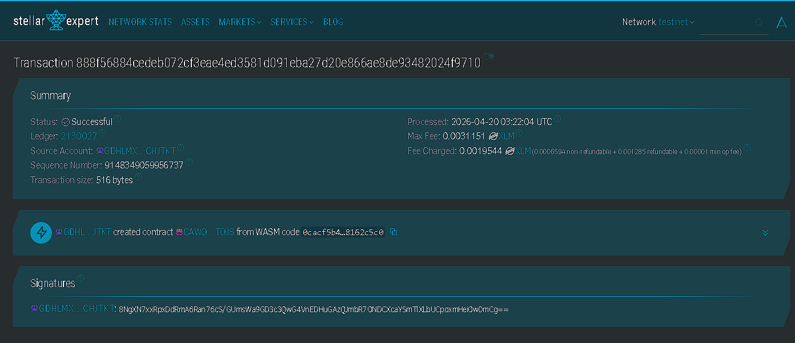

# Inventra PNJ

**Inventra PNJ** - Aplikasi Web Inventory Kelas untuk Politeknik Negeri Jakarta

## Project Description

Inventra PNJ adalah aplikasi web inventory kelas yang dirancang untuk membantu Politeknik Negeri Jakarta mengelola barang inventaris secara terpusat, rapi, dan mudah dipantau. Aplikasi ini berfokus pada kebutuhan operasional kelas dan ruang belajar, mulai dari peralatan presentasi, furniture, hingga barang habis pakai yang digunakan dalam kegiatan akademik sehari-hari.

Sistem ini memungkinkan admin untuk melakukan proses **CRUD (Create, Read, Update, Delete)** terhadap data inventaris, sekaligus memberi mahasiswa akses untuk melihat ketersediaan barang, mengajukan peminjaman, dan melaporkan kerusakan atau kehilangan barang. Dengan pendekatan ini, inventaris kelas tidak hanya tercatat, tetapi juga aktif dikelola melalui alur kerja yang relevan untuk lingkungan kampus.

## Project Vision

Visi proyek ini adalah membangun sistem inventory kelas yang modern, praktis, dan mudah digunakan oleh civitas akademika PNJ dengan tujuan:

- **Merapikan Pengelolaan Inventaris**: Menyatukan pencatatan barang kelas dalam satu sistem yang konsisten
- **Meningkatkan Transparansi**: Memudahkan admin dan mahasiswa melihat status barang secara jelas
- **Mempercepat Proses Peminjaman**: Menyediakan alur pengajuan dan persetujuan peminjaman yang terstruktur
- **Mempermudah Pelaporan Masalah**: Memberi jalur cepat untuk melaporkan barang rusak atau hilang
- **Mendukung Pengembangan Bertahap**: Menjadikan sistem ini fondasi untuk dashboard, laporan, dan otomasi inventaris di masa depan

Kami membayangkan Inventra PNJ sebagai platform yang membantu pengelolaan aset kelas menjadi lebih tertib, efisien, dan siap dikembangkan sesuai kebutuhan kampus.

## Key Features

### 1. **CRUD Data Inventaris**

- Tambah data barang inventaris baru
- Lihat daftar barang dan detail inventaris
- Ubah informasi barang, lokasi, jumlah, dan kondisi
- Hapus data inventaris yang sudah tidak valid atau tidak digunakan

### 2. **Klasifikasi Inventaris Campuran**

- Mendukung peralatan kelas dan laboratorium
- Mendukung furniture dan aset ruangan
- Mendukung barang habis pakai
- Memungkinkan pengelompokan berdasarkan kategori, lokasi, dan status

### 3. **Pengajuan Peminjaman Barang**

- Mahasiswa dapat mengajukan peminjaman barang yang tersedia
- Admin dapat meninjau permintaan peminjaman
- Sistem mendukung status pengajuan seperti menunggu, disetujui, atau ditolak
- Riwayat peminjaman dapat digunakan untuk pelacakan penggunaan barang

### 4. **Pelaporan Kerusakan**

- Mahasiswa dapat mengirim laporan ketika barang rusak, hilang, atau tidak layak pakai
- Admin dapat menindaklanjuti laporan berdasarkan kondisi barang
- Status barang dapat diperbarui menjadi rusak, dalam perbaikan, atau tidak tersedia
- Membantu menjaga kualitas inventaris kelas secara berkelanjutan

### 5. **Dashboard Status Inventaris**

- Menampilkan ringkasan barang tersedia, dipinjam, rusak, dan habis
- Membantu admin memantau kondisi inventaris secara cepat
- Mempermudah pengambilan keputusan terkait pengadaan dan perawatan barang
- Menjadi dasar untuk pengembangan laporan inventaris yang lebih lengkap

## Application Scope

- Target Pengguna: Mahasiswa dan Admin
- Ruang Lingkup Inventaris: Peralatan kelas, furniture, dan barang habis pakai
- Fokus MVP: CRUD inventaris, peminjaman dengan approval admin, dan pelaporan kerusakan
  

## Contract Details

- Contract Address: CDMLSEUCYEJAWU6P6FLEED2IEYQMZ7Z3MJOEU6GEJQ5VXUQIAG4VBOQI
  

## Future Scope

### Short-Term Enhancements

1. **Pencarian dan Filter Lanjutan**: Memudahkan pencarian barang berdasarkan nama, kategori, lokasi, dan status
2. **Manajemen Lokasi Kelas**: Menambahkan pengelolaan ruang atau kelas sebagai unit inventaris
3. **Riwayat Aktivitas Barang**: Mencatat perubahan data, peminjaman, dan laporan kerusakan
4. **Notifikasi Status Pengajuan**: Memberi pembaruan kepada mahasiswa terkait hasil approval peminjaman

### Medium-Term Development

5. **QR Code untuk Identifikasi Barang**: Mempermudah pengecekan barang melalui kode unik
   - Label inventaris per item
   - Proses pengecekan cepat oleh admin
   - Validasi barang saat peminjaman atau pengembalian
6. **Laporan Inventaris Berkala**: Rekap barang berdasarkan kondisi, lokasi, dan penggunaan
7. **Manajemen Pengembalian Barang**: Alur pengembalian untuk barang yang dipinjam
8. **Multi-Role Access**: Penambahan peran dosen atau wali kelas untuk monitoring inventaris

### Long-Term Vision

9. **Integrasi Pengadaan Barang**: Menghubungkan data inventaris dengan kebutuhan pengadaan
10. **Analitik Pemakaian Inventaris**: Mengetahui barang yang paling sering digunakan atau paling sering rusak
11. **Akses Mobile-Friendly**: Optimalisasi antarmuka untuk penggunaan di perangkat mobile
12. **Integrasi SSO Kampus**: Sinkronisasi akun pengguna dengan sistem autentikasi kampus
13. **Audit Trail Lengkap**: Riwayat perubahan data untuk kebutuhan monitoring dan evaluasi
14. **Monitoring Antar Ruang/Kelas**: Pelacakan inventaris lintas beberapa ruang secara terpusat

### Institutional Features

15. **Standarisasi Inventaris Jurusan**: Penyelarasan kategori dan format data antar ruang kelas
16. **Pelaporan Kondisi Aset**: Ringkasan kondisi aset untuk kebutuhan administrasi kampus
17. **Dashboard Pengambilan Keputusan**: Dukungan data untuk perawatan, penggantian, dan distribusi barang
18. **Dukungan Multi-Bahasa**: Perluasan aksesibilitas untuk penggunaan yang lebih luas

---

## Technical Requirements

- Backend service untuk pengelolaan data inventaris
- Database untuk menyimpan data barang, peminjaman, dan laporan kerusakan
- Frontend web application untuk mahasiswa dan admin
- Sistem autentikasi dan otorisasi berbasis peran

## Getting Started

Pengembangan awal aplikasi ini akan berpusat pada modul inti berikut:

- `create_item()` - Menambahkan barang inventaris baru
- `get_items()` - Melihat daftar dan detail barang inventaris
- `update_item()` - Memperbarui data barang, stok, lokasi, atau kondisi
- `delete_item()` - Menghapus data barang inventaris
- `create_borrow_request()` - Mengajukan peminjaman barang oleh mahasiswa
- `create_damage_report()` - Membuat laporan kerusakan atau kehilangan barang

---

**Inventra PNJ** - Membangun Pengelolaan Inventory Kelas yang Lebih Tertib dan Modern
